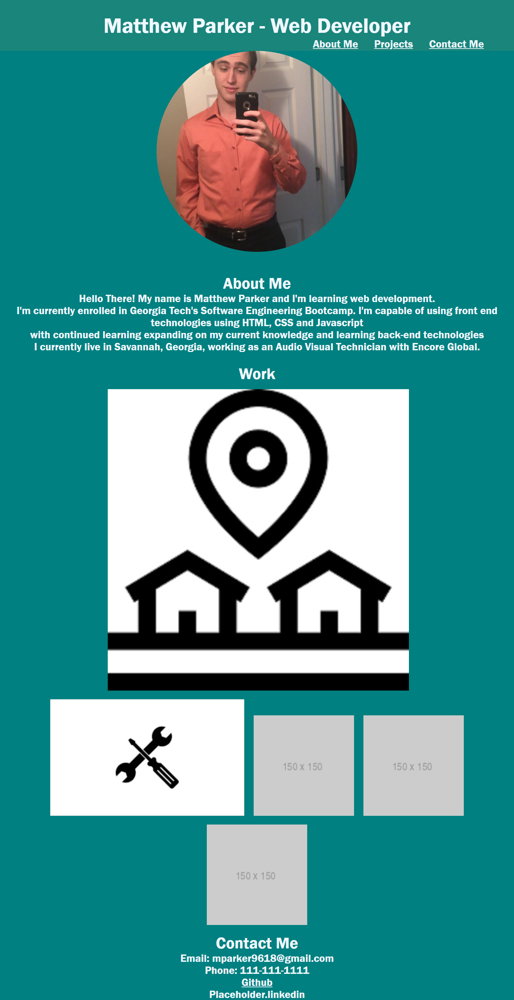

# Matthew-Parker-Web-Developer

## Description

This application is to serve as my portfolio for my learning and work as a web developer. As more knowledge is gathered and better practices are developed, this application will be updated wuth content reflecting my work as a developer, styles to enhance the page such fullpage.js, and information of myself as my journey as a developer lengthens

## Installation

This application is deployed on Github pages

## Usage
The usage of this application is to serve as my portfolio for my work as a web developer. It is to show potential employers my capabilites as a developer through the use of projects I have created as well as information about myself and how to contact me

URL to deployed site: https://mparker96.github.io/Matthew-Parker-Web-Developer/ 

    

## Credits

N/A
## License

MIT License
